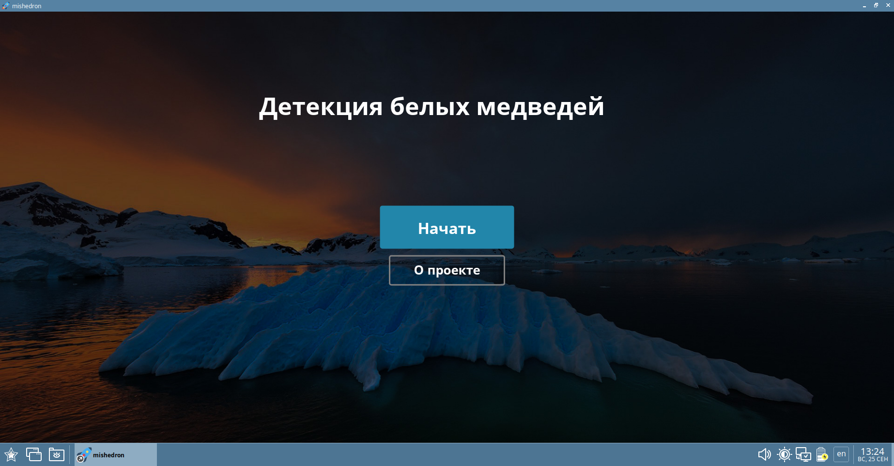
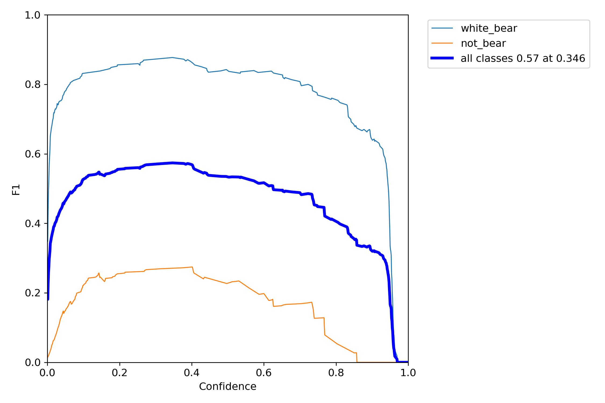

# Детекция белых медведей

## Тизер решения
Разработанное приложение автоматически идентифицирует белых медведей на массиве аэрофотосъемки с целью отслеживания вида в дикой природе.

Детекция осуществляется с помощью современных открытых технологий машинного обучения в области компьютерного зрения (OpenCV, YOLOv7). Учёным-полярникам нужно всего лишь запустить приложение на своем компьютере, выбрать папку с фотографиями и начать анализ. Искусственный интеллект выдаст отчёт, на каких участках фотографий обнаружены белые медведи.

## Уникальность
За счёт использования открытого фреймворка Electron решение не требует подключения к Интернету и может использоваться как на Microsoft Windows, так и на Linux, включая отечественные дистрибутивы.

## Стек технологий
* OpenCV, YOLOv7
* Python, ONNX, FastAPI, Uvicorn
* Node.js, Electron

## Оценка классификации

## Команда «Чай с Молочком»
* [Тимур Низамов](https://github.com/nizamovtimur) – Team Leader
* [Владислав Сайфулин](https://github.com/SayWas) – ML engineer
* [Дмитрий Шушарин](https://github.com/Dima2002iq) – UX/UI engineer
* [Александр Ростовский](https://github.com/Alexandr-Fox) – ML engineer
* [Егор Обрядов](https://github.com/E-Obryadov) – UX/UI designer

*Проект выполнен на окружном хакатоне «Цифровой прорыв: Сезон Искусственный интеллект» в Центральном федеральном округе (г. Москва) с 23 по 25 сентября 2022 года, вошёл в топ-5 решений кейса «Найти белого медведя с помощью ИИ» от Минприроды России*